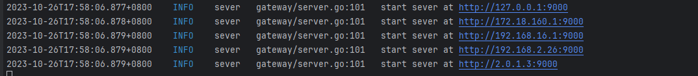

ipfs s3 网关
目前常用的s3 接口已经实现

# ipfs安装
[官方仓库](https://github.com/ipfs/kubo.git)
修改配置文件。
把/ip4/127.0.0.1/tcp/5001修改为/ip4/0.0.0.0/tcp/5001
```json
{
"Addresses": {
    "API": "/ip4/0.0.0.0/tcp/5001",
    "Announce": [],
    "AppendAnnounce": [],
    "Gateway": "/ip4/127.0.0.1/tcp/8080",
    "NoAnnounce": [],
    "Swarm": [
      "/ip4/0.0.0.0/tcp/4001",
      "/ip6/::/tcp/4001",
      "/ip4/0.0.0.0/udp/4001/quic",
      "/ip4/0.0.0.0/udp/4001/quic-v1",
      "/ip4/0.0.0.0/udp/4001/quic-v1/webtransport",
      "/ip6/::/udp/4001/quic",
      "/ip6/::/udp/4001/quic-v1",
      "/ip6/::/udp/4001/quic-v1/webtransport"
    ]
  }
}
```
# 启动方式
## build fds
```shell
make build
```
## Run
```shell
# --pool-addr 为ipfs 地址
./fds daemon --pool-addr=/ip4/192.168.2.30/tcp/5001
```
启动没有报错，就可以正常使用了。


```bash
# 默认ak/sk
access_key = filedagadmin
secret_key = filedagadmin
```
s3cmd使用配置
```
access_key = filedagadmin
secret_key = filedagadmin
host_base = 192.168.2.26:9000
host_bucket = bucket-name
use_https = false
```
# Contributing
PRs are welcome!